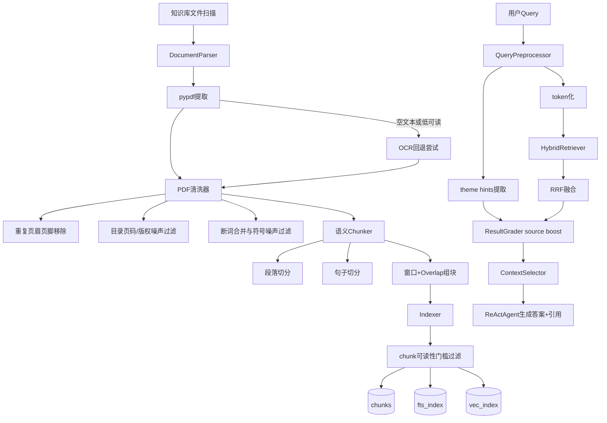

# RAG 架构说明（P0 + P1 已执行）

更新时间：2026-03-20

## 1. 总览

当前链路已经按 `Eval/PDF.md` 执行 P0 + P1：

1. PDF 解析：`pypdf` 主路径 + OCR 回退通道（可配置开关，缺依赖时自动降级）。
2. 文本清洗：页眉页脚/目录页码/结构噪声/符号乱码/短噪声行清理，并合并断词。
3. Chunking：由固定字符切块升级为段落/句子感知切块，再做窗口与 overlap。
4. 入库门槛：对 PDF chunk 执行最小可读性过滤，低质量 chunk 直接丢弃。
5. 检索排序：Hybrid(FTS+Vec)+RRF+Grader，增加 query 主题 source boost。
6. 可观测性：同步时输出 `parse_method/readability/noise_ratio/chunks_dropped`。

---

## 2. 端到端流程图

---

## 3. 文件清洗（P0）

实现位置：`src/RAG/preprocessing/parser.py`

### 3.1 PDF 解析策略

1. 主路径：`PdfReader(...).extract_text()` 分页提取。
2. 触发 OCR 条件：文本为空或 `readability_score < ocr_trigger_readability`。
3. OCR 路径：`pymupdf + pytesseract`（依赖缺失时记录 `ocr_unavailable`，不中断流程）。
4. 移除旧的 `bytes decode` 作为 PDF 正常回退路径，避免 `xref/stream/endobj` 污染。

### 3.2 清洗规则

1. 重复页眉/页脚：按多页高频签名检测并移除。
2. 目录/页码/版权噪声：规则过滤（`目录`、`Page x of y`、`版权所有` 等）。
3. 断词合并：`inter-\nnational -> international`。
4. 符号密度过滤：高符号低语义行丢弃。
5. 超短无语义行过滤：仅数字/符号短行丢弃。

### 3.3 可观测指标

每个 PDF 输出：

1. `parse_method`
2. `readability_score`
3. `noise_ratio`
4. `raw_lines / kept_lines / removed_lines`
5. 各类 removed 细分计数

---

## 4. Chunking（P1）

实现位置：`src/RAG/reader/chunker.py`

### 4.1 分块策略

1. 先按段落切分（空行边界）。
2. 长段落再按句子切分（中文/英文句末标点）。
3. 对超长句做二次 rebalance。
4. 最终按 `chunk_size` 组块，并保留 `chunk_overlap` 尾部重叠。

### 4.2 质量门槛

实现位置：`src/RAG/indexing/indexer.py`

1. 对 PDF chunk 计算可读性。
2. `readability < min_chunk_readability` 时不入库。
3. 返回 `chunks_dropped`，并在同步结果中汇总 `chunks_dropped_total`。

---

## 5. RAG 检索与重排（P1）

### 5.1 Query 预处理

实现位置：`src/core/search/query_preprocessor.py`

1. Token 化：英文词 + 中文连续片段 + 中文二元切片。
2. 主题识别：输出 `theme_hints`（如 `报关物流/报价合同/生产备货/...`）。

### 5.2 主题 source boost

实现位置：`src/core/search/grader.py`

1. 在 candidate score 中加入 `source_theme_boost`。
2. 当 query 主题与 `source/source_path/section_title/canonical_source_id` 命中时加分。
3. 匹配且为 PDF 源时给予额外加分。
4. boost 分值写入 `grading.source_theme_boost`，用于 trace 回溯。

### 5.3 上下文选择

实现位置：`src/core/search/context_selector.py`

1. 按 source 软配额分配 Top-K。
2. 去重（内容与 chunk key 双重去重）。
3. 构建分组 citation（版本/别名聚合）。

---

## 6. 关键配置

配置入口：`config/config.json` + `.env`

1. `knowledge_base.ocr_enabled`
2. `knowledge_base.ocr_language`
3. `knowledge_base.ocr_dpi_scale`
4. `knowledge_base.ocr_trigger_readability`
5. `knowledge_base.min_chunk_readability`
6. `knowledge_base.chunk_size`
7. `knowledge_base.chunk_overlap`

---

## 7. 本次评测结果（golden_set）

对比基线：

- baseline：`Eval/report/golden_set/20260320-010950/eval_report.json`
- current：`Eval/report/golden_set/20260320-p0p1-golden/eval_report.json`

核心指标：

1. `overall_score`: **0.6650 -> 0.6943**
2. `must_source_recall_avg`: **0.2000 -> 0.2500**
3. `strict_citation_rate`: **0.2000 -> 0.2500**
4. `source_precision_avg`: **0.0500 -> 0.1000**
5. `must_keyword_coverage_avg`: **0.9250 -> 0.9750**

结论：当前版本已超过上次 baseline。
